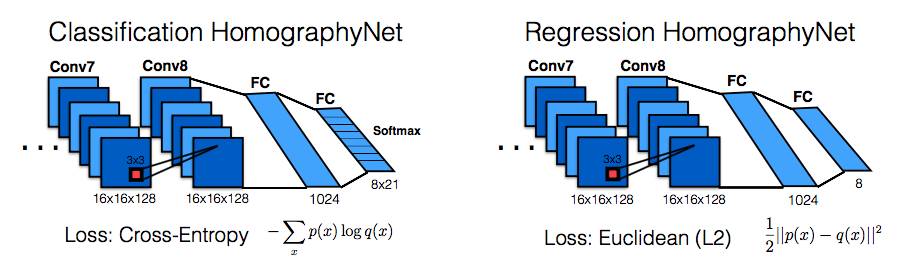
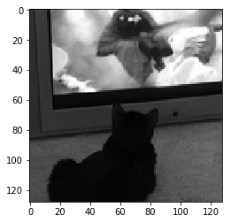
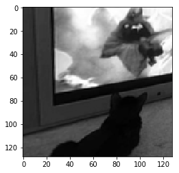

# HomographyNet Implementation in Keras / TensorFlow
** by Richard Guinto **
*<richard.guinto@gmail.com>*

## Description

Deep Image Homography Estimation a.k.a. HomographyNet is a Deep Convulation Neural Network which directly produces the Homography relating two images.  The paper is fully described from this link:  https://arxiv.org/pdf/1606.03798.pdf




# Dataset
The dataset was generated using images from the COCO 2017 Test Images as described in the paper.
Samples are bundled together in NumPy archives (.npz), with 9216 samples per archive.
I used 40 archives during the training, and 3 archives for the evaluation.

Each archive is ~289MiB


```python
%ls "dataset\\test"
```

     Volume in drive C has no label.
     Volume Serial Number is 4A9E-AED8
    
     Directory of C:\Users\Richard Guinto\msee\dataset\test
    
    10/22/2017  07:14 PM    <DIR>          .
    10/22/2017  07:14 PM    <DIR>          ..
    10/22/2017  07:14 PM             6,148 .DS_Store
    10/22/2017  07:14 PM       302,580,104 f7823b11-901a-457a-89a2-8c37dc4fef60.npz
    10/22/2017  07:14 PM       302,580,104 fa6716a8-218c-42b1-a6aa-3fd014eb0f64.npz
    10/22/2017  07:14 PM       302,580,104 faf48514-698b-45e3-ae58-60c9189e0426.npz
                   4 File(s)    907,746,460 bytes
                   2 Dir(s)  681,769,811,968 bytes free
    


```python
%matplotlib inline
```


```python
import numpy as np
import matplotlib.pyplot as plt
import os.path
import glob

path = "dataset/test/f7823b11-901a-457a-89a2-8c37dc4fef60.npz"
print('path:', os.path.abspath(path))

archive = np.load(os.path.abspath(path))
print('keys:', archive.files)
```

    path: C:\Users\Richard Guinto\msee\dataset\test\f7823b11-901a-457a-89a2-8c37dc4fef60.npz
    keys: ['images', 'offsets']
    


```python
images = archive['images']
offsets = archive['offsets']

print('images.shape: ', images.shape)
print('offsets.shape: ', offsets.shape)
```

    images.shape:  (9216, 128, 128, 2)
    offsets.shape:  (9216, 8)
    


```python
sample_image = np.split(images[0], 2, axis=-1)
plt.imshow(sample_image[0].squeeze(), cmap='gray')
```


    <matplotlib.image.AxesImage at 0x153ecb70>





```python
plt.imshow(sample_image[1].squeeze(), cmap='gray')
```


    <matplotlib.image.AxesImage at 0x16472780>





```python
sample_offset = offsets[0]
print('sample offset: ', sample_offset)
```

    sample offset:  [ -4  -6 -29 -12  -3 -23  -2  24]
    

The offset represents the displacement x,y with respect to the patch corner points


```python
#data loading in Keras (credits: baudm)

def data_loader(path, batch_size=64):
    """Generator to be used with model.fit_generator()"""
    while True:
        for npz in glob.glob(os.path.join(path, '*.npz')):
            # Load pack into memory
            archive = np.load(npz)
            images = archive['images']
            offsets = archive['offsets']
            # Yield minibatch
            for i in range(0, len(offsets), batch_size):
                end_i = i + batch_size
                try:
                    batch_images = images[i:end_i]
                    batch_offsets = offsets[i:end_i]
                except IndexError:
                    continue
                # Normalize
                batch_images = (batch_images - 127.5) / 127.5
                batch_offsets = batch_offsets / 32.
                yield batch_images, batch_offsets
                
```


```python
from keras import backend as K

#Loss Function using SMSE
def euclidean_l2(y_true, y_pred):
    return K.sqrt(K.sum(K.square(y_pred - y_true), axis=-1, keepdims=True))

def mace(y_true, y_pred):
    return K.mean(32*K.sqrt(K.sum(K.square(K.reshape(y_pred, (-1,4,2)) - K.reshape(y_true, (-1,4,2))),\
        axis=-1, keepdims=True)),axis=1)

```

    Using TensorFlow backend.
    


```python
samples_per_archive = images.shape[0]
print('samples per archive: ', samples_per_archive)
```

    samples per archive:  9216
    

## Training
The python script below is the training model.


```python
from keras.models import Sequential
from keras.layers import Activation, Dense, Dropout, Conv2D, MaxPooling2D, Flatten, BatchNormalization, InputLayer
from keras.callbacks import ModelCheckpoint
from keras import backend as K
from keras import optimizers
import tensorflow as tf

# Dataset-specific
train_data_path = 'dataset/training'
test_data_path = 'dataset/test'
samples_per_archive = 9216
num_archives = 40
# 43 archives x 9,216 samples per archive, but use just 40 and save the 3 for testing
num_samples = num_archives * samples_per_archive


# From the paper
batch_size = 64
total_iterations = 90000

steps_per_epoch = num_samples / batch_size # As stated in Keras docs
epochs = int(total_iterations / steps_per_epoch)

input_shape = (128, 128, 2)
kernel_size = 3
pool_size = 2
filters = 64
dropout = 0.5


model = Sequential()
model.add(InputLayer(input_shape))
model.add(Conv2D(filters=filters,\
        kernel_size=kernel_size, activation='relu', padding='same'))
model.add(BatchNormalization())
model.add(Conv2D(filters=filters,\
        kernel_size=kernel_size, activation='relu', padding='same'))
model.add(BatchNormalization())
model.add(MaxPooling2D(pool_size))
model.add(Conv2D(filters=filters,\
        kernel_size=kernel_size, activation='relu', padding='same'))
model.add(BatchNormalization())
model.add(Conv2D(filters=filters,\
        kernel_size=kernel_size, activation='relu', padding='same'))
model.add(BatchNormalization())
model.add(MaxPooling2D(pool_size))
model.add(Conv2D(filters=filters*2,\
        kernel_size=kernel_size, activation='relu', padding='same',))
model.add(BatchNormalization())
model.add(Conv2D(filters=filters*2,\
        kernel_size=kernel_size, activation='relu', padding='same',))
model.add(BatchNormalization())
model.add(MaxPooling2D(pool_size))
model.add(Conv2D(filters=filters*2,\
        kernel_size=kernel_size, activation='relu', padding='same',))
model.add(BatchNormalization())
model.add(Conv2D(filters=filters*2,\
        kernel_size=kernel_size, activation='relu', padding='same',))
model.add(BatchNormalization())
model.add(Flatten())
model.add(Dropout(dropout))
model.add(Dense(1024, activation='relu'))
model.add(Dropout(dropout))
#for regression model
model.add(Dense(8))
#model.add(Activation('softmax'))
model.summary()

#use optimizer Stochastic Gradient Methond with a Learning Rate of 0.005 and momentum of 0.9
#sgd = optimizers.SGD(lr=0.005, momentum=0.9, decay=0.001355)
sgd = optimizers.SGD(lr=0.005, momentum=0.9)

#compile model
model.compile(loss=euclidean_l2,\
        optimizer=sgd, metrics=['mean_squared_error'])

#check point
filepath = "checkpoints/weights-{epoch:02d}-{loss:.2f}.hdf5"
checkpoint = ModelCheckpoint(filepath, monitor='loss', verbose=1)
callback_list = [checkpoint]

# Train
print('TRAINING...')
model.fit_generator(data_loader(train_data_path, batch_size),
                    steps_per_epoch=steps_per_epoch,
                    epochs=epochs, callbacks=callback_list)

```

### Model Summary


### Below is the screenshot of the training results for 15 epochs


## Testing / Evaluation
The training produced the record of the weights for each epoch and the last checkpoint was used to load for the model evaluation


```python
%ls -l checkpoints
```

     Volume in drive C has no label.
     Volume Serial Number is 4A9E-AED8
    
     Directory of C:\Users\Richard Guinto\msee
    
    
     Directory of C:\Users\Richard Guinto\msee\checkpoints
    
    10/23/2017  06:55 PM    <DIR>          .
    10/23/2017  06:55 PM    <DIR>          ..
    10/23/2017  06:37 AM       273,658,120 weights-01-1.08.hdf5
    10/23/2017  06:37 AM       273,658,120 weights-02-0.86.hdf5
    10/23/2017  06:38 AM       273,658,120 weights-03-0.77.hdf5
    10/23/2017  06:38 AM       273,658,120 weights-04-0.72.hdf5
    10/23/2017  06:38 AM       273,658,120 weights-05-0.68.hdf5
    10/23/2017  06:38 AM       273,658,120 weights-06-0.66.hdf5
    10/23/2017  06:39 AM       273,658,120 weights-07-0.64.hdf5
    10/23/2017  06:39 AM       273,658,120 weights-08-0.62.hdf5
    10/23/2017  06:39 AM       273,658,120 weights-09-0.61.hdf5
    10/22/2017  08:58 PM       273,658,120 weights-10-0.60.hdf5
    10/23/2017  06:40 AM       273,658,120 weights-11-0.58.hdf5
    10/23/2017  06:40 AM       273,658,120 weights-12-0.57.hdf5
    10/23/2017  06:40 AM       273,658,120 weights-13-0.57.hdf5
    10/23/2017  06:40 AM       273,658,120 weights-14-0.56.hdf5
                  14 File(s)  3,831,213,680 bytes
                   2 Dir(s)  681,763,631,104 bytes free
    

    File Not Found
    

The python script below is used to evaluate our trained model with the 3 test archives (3 x 9216 samples).
I modified the metrics to use the custom function to define the Mean Average Corner Error (mace) instead of just the mean square error used in the training.


```python
from keras.models import load_model
from keras import optimizers

#Model Checkpoint
checkpoint = "checkpoints/weights-14-0.56.hdf5"
test_data_path = "datasets/test"

test_samples = 3 * samples_per_archive
batch_size = 64
steps = test_samples / batch_size

# load model
model = load_model(checkpoint, custom_objects={'euclidean_l2': euclidean_l2, 'mace': mace})

#use optimizer Stochastic Gradient Methond with a Learning Rate of 0.005 and momentum of 0.9
sgd = optimizers.SGD(lr=0.005, momentum=0.9)

#compile model
model.compile(loss=euclidean_l2,\
        optimizer=sgd, metrics=[mace])

# Test
score = model.evaluate_generator(data_loader(test_data_path, batch_size),
                         steps=steps)

print('Test score:', score)

```

## Testing Result:
The Mean Average Corner Error for the evaluation phase resulted to 6.30 pixels only, which is better than 9.2 pixels (the published result in the paper).


## Prediction samples
This python code shows the prediction results with the first 10 samples of the test archive.
The result of each prediction is a normalized value (-1 to 1).  To get the actual offset value, we multiply the result by 32 (p = 32 in the paper).
Mean Square Error is used for our metrics, while Root Mean Square Error is used for the loss function.
On Mean Average Corner Error is still less than the 9.2pixel average described in the paper.


```python
from keras.models import load_model

#checkpoint
checkpoint = "checkpoints/weights-14-0.56.hdf5"

# load model
print('Loading model... ', checkpoint)
model = load_model(checkpoint, custom_objects={'euclidean_l2': euclidean_l2})

for idx in range(10):
    print('SAMPLE ', idx)
    sample_image = images[idx];
    sample_shape = sample_image.shape
    sample_image = sample_image.reshape(1, 128, 128, 2)
    sample_offset = offsets[idx];
    print('Sample Offset: ', sample_offset)
    norm_sample_image = (sample_image - 127.5) / 127.5
    norm_sample_offset = sample_offset / 32.
    print('Normalize Sample Offset: ', norm_sample_offset)

    print('Predicting Offset...')
    norm_pred_offset = model.predict(norm_sample_image)
    print('Predicted Offset(Normalize): ', norm_pred_offset)
    pred_offset = norm_pred_offset * 32.
    print('Predicted Offset: ', pred_offset)
    rmse = np.sqrt(np.sum(np.square(norm_pred_offset - norm_sample_offset),axis=-1,keepdims=True))
    print('Normalize RMSE: ', rmse)
    norm_mse = np.mean(np.square(norm_pred_offset - norm_sample_offset), axis=-1, keepdims=True)
    print('Normalize MSE: ', norm_mse)
    mse = np.mean(np.square(pred_offset - sample_offset), axis=-1, keepdims=True)
    print('MSE: ', mse)
    norm_mae = np.mean(np.absolute(norm_pred_offset - norm_sample_offset), axis=-1, keepdims=True)
    print('Normalize MAE: ', norm_mae)
    mae = np.mean(np.absolute(pred_offset - sample_offset), axis=-1, keepdims=True)
    print('MAE: ', mae)
    sum = 0
    for i in range(0, len(sample_offset),2):
        h = np.square(pred_offset[0][i] - sample_offset[i]) + np.square(pred_offset[0][i+1] - sample_offset[i+1])
        h = np.sqrt(h)
        #print('h: ', h)
        sum = sum + h
    mace = sum / (len(sample_offset) / 2)
    print('Mean Ave. Corner Error: ', mace)

```

    Loading model...  checkpoints/weights-14-0.56.hdf5
    SAMPLE  0
    Sample Offset:  [ -4  -6 -29 -12  -3 -23  -2  24]
    Normalize Sample Offset:  [-0.125   -0.1875  -0.90625 -0.375   -0.09375 -0.71875 -0.0625   0.75   ]
    Predicting Offset...
    Predicted Offset(Normalize):  [[-0.14250475 -0.05554018 -0.92104042 -0.36435172 -0.11278056 -0.63863069
      -0.19482951  0.59375417]]
    Predicted Offset:  [[ -4.56015205  -1.77728581 -29.4732933  -11.65925503  -3.60897803
      -20.43618202  -6.23454428  19.00013351]]
    Normalize RMSE:  [[ 0.25837391]]
    Normalize MSE:  [[ 0.00834463]]
    MSE:  [[ 8.54490576]]
    Normalize MAE:  [[ 0.07032856]]
    MAE:  [[ 2.25051391]]
    Mean Ave. Corner Error:  3.50753724314
    SAMPLE  1
    Sample Offset:  [ 27 -28  -7  -6 -31 -20  -5   3]
    Normalize Sample Offset:  [ 0.84375 -0.875   -0.21875 -0.1875  -0.96875 -0.625   -0.15625  0.09375]
    Predicting Offset...
    Predicted Offset(Normalize):  [[ 0.60214853 -0.70988363 -0.21000905 -0.03854291 -0.65358949 -0.66570729
      -0.03431126 -0.10413262]]
    Predicted Offset:  [[ 19.26875305 -22.71627617  -6.72028971  -1.23337317 -20.91486359
      -21.30263329  -1.09796035  -3.33224392]]
    Normalize RMSE:  [[ 0.51274665]]
    Normalize MSE:  [[ 0.03286364]]
    MSE:  [[ 33.65236782]]
    Normalize MAE:  [[ 0.15501313]]
    MAE:  [[ 4.96042015]]
    Mean Ave. Corner Error:  7.93649736027
    SAMPLE  2
    Sample Offset:  [ 19 -31  -4   5 -27  -5  27  13]
    Normalize Sample Offset:  [ 0.59375 -0.96875 -0.125    0.15625 -0.84375 -0.15625  0.84375  0.40625]
    Predicting Offset...
    Predicted Offset(Normalize):  [[ 0.55748105 -0.72920072 -0.10686783  0.16751814 -0.22563538 -0.47743446
       0.70303178  0.28376466]]
    Predicted Offset:  [[ 17.83939362 -23.33442307  -3.41977048   5.36058044  -7.22033215
      -15.2779026   22.49701691   9.08046913]]
    Normalize RMSE:  [[ 0.76104169]]
    Normalize MSE:  [[ 0.07239806]]
    MSE:  [[ 74.13561035]]
    Normalize MAE:  [[ 0.18846515]]
    MAE:  [[ 6.03088471]]
    Mean Ave. Corner Error:  9.17414138186
    SAMPLE  3
    Sample Offset:  [ 18 -16  21  -1  17 -11 -19 -16]
    Normalize Sample Offset:  [ 0.5625  -0.5      0.65625 -0.03125  0.53125 -0.34375 -0.59375 -0.5    ]
    Predicting Offset...
    Predicted Offset(Normalize):  [[ 0.76808685 -0.46365145  0.70317274 -0.07748534  0.56381035 -0.34365073
      -0.64307743 -0.5176217 ]]
    Predicted Offset:  [[ 24.57877922 -14.83684635  22.50152779  -2.47953081  18.04193115
      -10.99682331 -20.57847786 -16.56389427]]
    Normalize RMSE:  [[ 0.22744346]]
    Normalize MSE:  [[ 0.00646632]]
    MSE:  [[ 6.62150741]]
    Normalize MAE:  [[ 0.05433778]]
    MAE:  [[ 1.73880893]]
    Mean Ave. Corner Error:  2.87672751712
    SAMPLE  4
    Sample Offset:  [-24  26 -14 -26 -13 -14 -10  -9]
    Normalize Sample Offset:  [-0.75     0.8125  -0.4375  -0.8125  -0.40625 -0.4375  -0.3125  -0.28125]
    Predicting Offset...
    Predicted Offset(Normalize):  [[-0.78741205  0.41173747 -0.57676262 -0.87145525 -0.46138126 -0.53484929
      -0.69419068 -0.19469351]]
    Predicted Offset:  [[-25.19718552  13.1755991  -18.45640373 -27.88656807 -14.76420021
      -17.11517715 -22.21410179  -6.23019218]]
    Normalize RMSE:  [[ 0.59209476]]
    Normalize MSE:  [[ 0.04382203]]
    MSE:  [[ 44.87375424]]
    Normalize MAE:  [[ 0.15714002]]
    MAE:  [[ 5.02848065]]
    Mean Ave. Corner Error:  8.45592787067
    SAMPLE  5
    Sample Offset:  [-31   3 -26  20  15  25 -14 -15]
    Normalize Sample Offset:  [-0.96875  0.09375 -0.8125   0.625    0.46875  0.78125 -0.4375  -0.46875]
    Predicting Offset...
    Predicted Offset(Normalize):  [[-0.92497671  0.12453513 -0.78725767  0.57240045  0.47227308  0.66715419
      -0.31599027 -0.37257075]]
    Predicted Offset:  [[-29.59925461   3.98512411 -25.19224548  18.31681442  15.11273861
       21.34893417 -10.11168861 -11.9222641 ]]
    Normalize RMSE:  [[ 0.20811785]]
    Normalize MSE:  [[ 0.00541413]]
    MSE:  [[ 5.5440692]]
    Normalize MAE:  [[ 0.06096352]]
    MAE:  [[ 1.95083266]]
    Mean Ave. Corner Error:  3.04780555406
    SAMPLE  6
    Sample Offset:  [-21 -31 -20 -24   4  -3 -20 -23]
    Normalize Sample Offset:  [-0.65625 -0.96875 -0.625   -0.75     0.125   -0.09375 -0.625   -0.71875]
    Predicting Offset...
    Predicted Offset(Normalize):  [[-0.61325133 -0.80329746 -0.52129155 -0.70986444 -0.01804418  0.05308453
      -0.49432555 -0.64243144]]
    Predicted Offset:  [[-19.62404251 -25.70551872 -16.68132973 -22.715662    -0.57741368
        1.69870496 -15.81841755 -20.55780602]]
    Normalize RMSE:  [[ 0.32636189]]
    Normalize MSE:  [[ 0.01331401]]
    MSE:  [[ 13.63354687]]
    Normalize MAE:  [[ 0.10614587]]
    MAE:  [[ 3.39666776]]
    Mean Ave. Corner Error:  5.10779034277
    SAMPLE  7
    Sample Offset:  [  3   3  13  27  21 -14   4   9]
    Normalize Sample Offset:  [ 0.09375  0.09375  0.40625  0.84375  0.65625 -0.4375   0.125    0.28125]
    Predicting Offset...
    Predicted Offset(Normalize):  [[ 0.13763909  0.06586245  0.53117824  0.5813545   0.699045   -0.44823477
       0.24651718  0.35018265]]
    Predicted Offset:  [[  4.40445089   2.1075983   16.99770355  18.60334396  22.36944008
      -14.34351254   7.8885498   11.20584488]]
    Normalize RMSE:  [[ 0.32958643]]
    Normalize MSE:  [[ 0.0135784]]
    MSE:  [[ 13.90428345]]
    Normalize MAE:  [[ 0.087885]]
    MAE:  [[ 2.81231993]]
    Mean Ave. Corner Error:  4.21156179327
    SAMPLE  8
    Sample Offset:  [-11  -8 -31 -17  27 -15 -17   5]
    Normalize Sample Offset:  [-0.34375 -0.25    -0.96875 -0.53125  0.84375 -0.46875 -0.53125  0.15625]
    Predicting Offset...
    Predicted Offset(Normalize):  [[-0.18427196 -0.10376725 -0.99645287 -0.43895617  0.73803866 -0.43310711
      -0.43818918  0.15883529]]
    Predicted Offset:  [[ -5.89670277  -3.32055187 -31.88649178 -14.04659748  23.61723709
      -13.85942745 -14.02205372   5.08272934]]
    Normalize RMSE:  [[ 0.27787617]]
    Normalize MSE:  [[ 0.0096519]]
    MSE:  [[ 9.8835413]]
    Normalize MAE:  [[ 0.08283848]]
    MAE:  [[ 2.65083134]]
    Mean Ave. Corner Error:  4.13912026992
    SAMPLE  9
    Sample Offset:  [-20  26 -26 -10  16 -13  24  28]
    Normalize Sample Offset:  [-0.625    0.8125  -0.8125  -0.3125   0.5     -0.40625  0.75     0.875  ]
    Predicting Offset...
    Predicted Offset(Normalize):  [[-0.66163307  0.59332019 -0.73886538 -0.22212261  0.62033647 -0.42941627
       0.39361817  0.69835544]]
    Predicted Offset:  [[-21.17225838  18.98624611 -23.64369202  -7.10792351  19.85076714
      -13.74132061  12.59578133  22.34737396]]
    Normalize RMSE:  [[ 0.48600489]]
    Normalize MSE:  [[ 0.02952509]]
    MSE:  [[ 30.23369694]]
    Normalize MAE:  [[ 0.13704425]]
    MAE:  [[ 4.38541615]]
    Mean Ave. Corner Error:  6.87280602189
    
